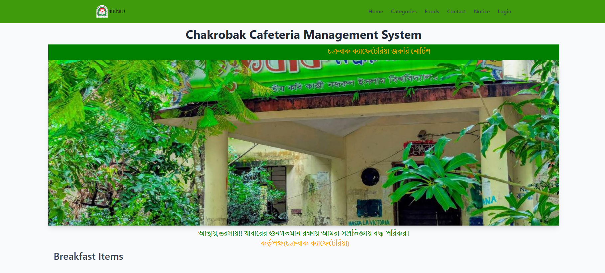

# 🥘 Food Order Website

This is a **Food Ordering Website** developed using **Core PHP and MySQL** for my university project at ** ([JKKNIU](https://www.jkkniu.edu.bd/))**.
This project allows users to browse food items, place orders, and enables admin to manage the entire system.

The main purpose of this project is to learn **PHP CRUD operations**, **Admin Panel Management**, and **Database Integration**.

---

# 🚀 Project Overview

This project includes:

- Food browsing system
- Category based food listing
- Easy food ordering system
- Admin dashboard
- Order tracking and management

This project is suitable for:

- University Project
- PHP Beginners
- Admin Panel Practice
- Database Learning

---

# ⚙️ Technology Used

1. HTML5
2. CSS3
3. Core / Procedural PHP
4. MySQL Relational Database

---

# 🧰 Features

## User Side

- Browse all categories
- View food items
- Place order easily
- Simple user interface

## Admin Side

- Admin Login
- Manage Admin
- Manage Categories
- Manage Food Items
- Manage Orders
- Track Delivery
- Update Order Status

---

# 📸 Project Screenshots

## 🏠 Homepage



---

## 🍔 Food Items


---

## ⚙️ Admin Dashboard


---

# 📁 Project Folder Structure

```
food-order
│
├── admin
├── images
│   └── project1.png
├── config
├── css
├── js
├── database
├── index.php
└── README.md
```

---

# 📖 How to Download the Project and Run on your PC

## Pre-Requisites

### 1. Download and Install XAMPP

https://www.apachefriends.org/index.html

### 2. Install any Text Editor

- Visual Studio Code
- Sublime Text
- Atom
- Brackets

---

# ⚡ Installation

## 1. Download or Clone Project

Download ZIP or Clone this repository.

---

## 2. Move Project to Root Directory

Move project folder to:

```
C:\xampp\htdocs\food-order
```

---

## 3. Start XAMPP

Open XAMPP Control Panel and Start:

- Apache
- MySQL

---

## 4. Import Database

1. Open Browser
2. Go to phpMyAdmin
3. Create new Database
4. Import SQL file

---

## 5. Configure Database

Go to:

```
config/constants.php
```

Update the following code:

```php
<?php

session_start();

define('SITEURL', 'http://localhost/food-order/');
define('LOCALHOST', 'localhost');
define('DB_USERNAME', 'root');
define('DB_PASSWORD', '');
define('DB_NAME', 'food-order');

$conn = mysqli_connect(LOCALHOST, DB_USERNAME, DB_PASSWORD) or die(mysqli_error());
$db_select = mysqli_select_db($conn, DB_NAME) or die(mysqli_error());

?>
```

---

## 6. Run Project

Open browser and go to:

```
http://localhost/food-order
```

---

# 🔐 Admin Panel

Admin Login URL:

```
http://localhost/food-order/admin
```

Example Login:

Username: admin
Password: admin

---

# 🎯 Learning Outcomes

After completing this project you will learn:

- PHP CRUD Operations
- Admin Panel Development
- Session Handling
- Image Upload System
- Order Management
- MySQL Database Integration

---

# 🚀 Future Improvements

- Online Payment Integration
- User Login System
- Search System
- Responsive Design
- Email Notification

---

# 👨‍💻 Author

MD. Raful Mia
University Project
**JKKNIU ([Jatiya Kabi Kazi Nazrul Islam University](https://www.jkkniu.edu.bd/))**

---

# ⭐ Support

If you like this project, give it a ⭐ on GitHub.
